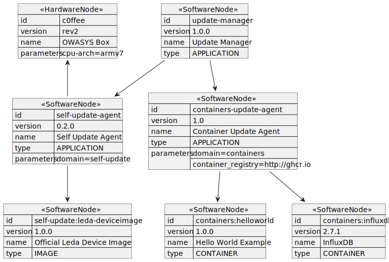

### Current State Representation

The cloud backend (or any OTA update system) needs to keep track of the current state of the device. This current state information is relevant as input for the context pipeline for compiling future desired states and acts as an indicator of problems in applying a given desired state, if the current state differs from the desired state, which may not be reached.

For representing the current state of the device, the approach of a holistic inventory of hardware and software nodes will be applied. This model is using a graph structure consisting of three element types - hardware nodes, software nodes, associations.

### Current State Data Model

The following table describes all supported properties and sections of the Current State specification:

| Property | Type | Description |
| - | - | - |
| **General properties** | | |
| hardwareNodes | JSON array | Inventory for a list of hardware nodes |
| softwareNodes | JSON array | Inventory for a list of software nodes |
| associations | JSON array | List of mappings between the inventory nodes |
| **Hardware node properties** | | |
| id | string | Identifier of the hardware node |
| version | string | Version of the hardware node |
| name | string | Name of a hardware node |
| parameters | JSON array | List of key/value parameters for a hardware node |
| addressable | boolean | Enables hardware node addressability |
| **Software node properties** | | |
| id | string | Identifier of the software node |
| version | string | Version of the software node |
| name | string | Name of the software node |
| parameters | JSON array | List of key/value parameters for a software node |
| type | string | Type of the software node. The supported types are listed below |
| **Parameter properties** | | |
| key | string | Key of the parameter |
| value | string | Value of the parameter |
| **Association parameter** | | |
| sourceId | string | Identifier of the source node of the association |
| targetId | string | Identifier of the target node of the association |

### Supported software types

The list of the supported software types :

| Type | Description |
| - | - |
| IMAGE | Represents an image software type |
| RAW | Represents a raw bytes software type |
| DATA | Represents a data software type |
| APPLICATION | Represents an application software type |
| CONTAINER | Represents a container software type |

### Device Inventory Graph Representation

The diagram below represents the Device Inventory graph and the links between the software and hardware nodes.

The software nodes are organized in the graph at different levels. At the root level stands the main Update Manager software node, which represents the Update Manager component. At the second level are placed the root nodes for each supported domain agent, which are linked with associations to the Update Manager node. At the last level in the hierarchy are placed the domain-specific software nodes, representing the domain components. These software nodes can be modeled the in a tree-based structure if the internal domain-specific representation is more complex.

The hardware nodes do not follow any strict hierarchy and can be linked to any hardware or software node. Any cycles between the nodes are not allowed and prevented.



### Current State Data Model Example

The following data structure is a holistic example view of a device current state:
```json
{
	"hardwareNodes": [
		{
			"id": "cOffee",
			"version": "rev2",
			"name": "OWASYS box",
			"parameters": [
				{
					"key": "cpu-arch",
					"value": "armv7"
				}
			]
		}
	],
	"softwareNodes": [
		{
			"id": "update-manager",
			"version": "1.0.0",
			"name": "Update Manager",
			"type": "APPLICATION"
		},
		{
			"id": "containers-update-agent",
			"version": "1.0",
			"name": "Containers Update Agent",
			"type": "APPLICATION",
			"parameters": [
				{
					"key": "domain",
					"value": "containers"
				},
				{
					"key": "container_registry",
					"value": "ghcr.io"
				}
			]
		},
		{
			"id": "containers:helloworld",
			"version": "1.0.0",
			"name": "Hello World Example",
			"type": "CONTAINER"
		},
		{
			"id": "containers:influxdb",
			"version": "2.7.1",
			"name": "InfluxDB",
			"type": "CONTAINER"
		},
		{
			"id": "self-update-agent",
			"version": "0.2.0",
			"name": "Self Update Agent",
			"type": "APPLICATION",
			"parameters": [
				{
					"key": "domain",
					"value": "self-update"
				}
			]
		},
		{
			"id": "self-update:leda-deviceimage",
			"version": "1.0.0",
			"name": "Official Leda Device Image",
			"type": "IMAGE"
		}
	],
	"associations": [
		{
			"sourceId": "update-manager",
			"targetId": "containers-update-agent"
		},
		{
			"sourceId": "update-manager",
			"targetId": "self-update-agent"
		},
		{
			"sourceId": "containers-update-agent",
			"targetId": "containers:helloworld"
		},
		{
			"sourceId": "containers-update-agent",
			"targetId": "containers:influxdb"
		},
		{
			"sourceId": "self-update-agent",
			"targetId": "self-update:leda-deviceimage"
		}
	]
}
```
