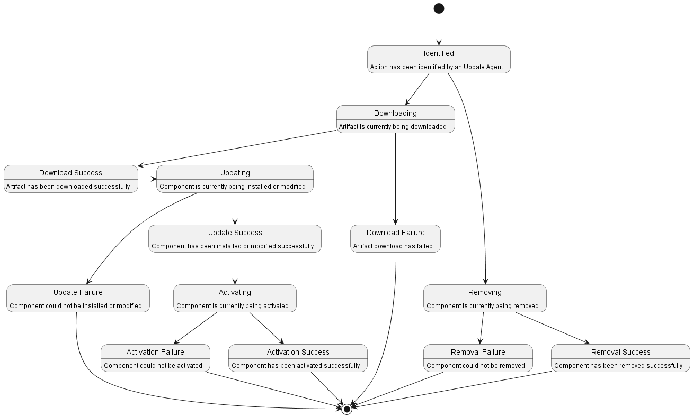
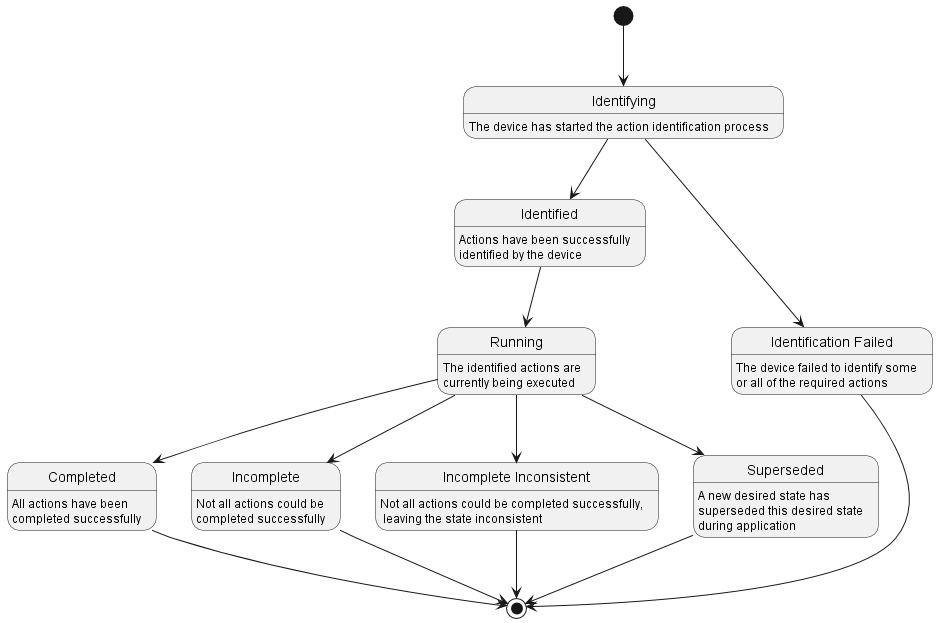

### Desired State Feedback Representation
The cloud backend (or OTA update system) needs to keep track of the update progress on both individual level as well as on campaign (or fleet) level. To achieve this purpose, the Update Manager introduces the Desired State Feedback as a common, structured and straightforward way for notifying the backend about the progress and status of the update.

The feedback is comprised by overall information for the current status of the ongoing update process, information for the status for each of the identified components and optional unstructured message. This message is meant to support projects with the need to transfer custom data such as a human readable progress information or internally used status codes.
Optionally, the feedback can be defined at baseline level by specifying additional information for the baseline the feedback is associated with. If not present, the feedback is considered to be related at domain level.

### Desired State Feedback Data Model

The following table describes all supported properties and sections of the Desired State specification:

| Property | Type | Description |
| - | - | - |
| **General properties** | | |
| status | string | [Status of the Desired State](#supported-desired-state-feedback-statuses) |
| baseline | string | Title of the baseline, the Desired State Feedback is associated with. Optional |
| message | string | Info message for the Desired State Feedback |
| actions | JSON array | Set of Desired State Feedback actions |
| **Action properties** | | |
| component | JSON object | The component, which is linked with the action |
| status | string | [Status the of action](#supported-desired-state-feedback-action-statuses) |
| progress | int | Progress of the action in percentage |
| message | string | Info message for the action |
| **Config properties** | | |
| key | string | Key of the configuration property |
| value | string | Value of the configuration property |
| **Component properties** | | |
| id | string | Identifier of the component |
| version | string | Version of the component |
| config | JSON object | Set of component-specific configuration properties as key/value pairs |

### Supported Desired State Feedback statuses

The list of the supported feedback statuses :

| Status | Description |
| - | - |
| IDENTIFYING | Denotes that action identification process has started |
| IDENTIFIED | Denotes that required actions are identified |
| IDENTIFICATION_FAILED | Denotes some or all of the required actions failed to be indentified |
| RUNNING | Denotes that identified actions are currently executing |
| DOWNLOADED_COMPLETED | Denotes that identified actions are downloaded successfully |
| DOWNLOADED_FAILED | Denotes that not all of the identified actions are downloaded successfully |
| UPDATE_COMPLETED | Denotes that identified actions are updated successfully |
| UPDATE_FAILED | Denotes that not all identified actions are updated successfully |
| ACTIVATION_COMPLETED | Denotes that identified actions are activated successfully |
| ACTIVATION_FAILED | Denotes that not all identified actions are activated successfully |
| COMPLETED | Denotes that identified actions completed successfully |
| INCOMPLETE | Denotes that not all of the identified actions completed successfully |
| INCOMPLETE_INCONSISTENT | Denotes that not all of the identified actions completed successfully, leaving the state inconsistent |
| SUPERSEDED | Denotes that the identified actions are no longer valid because new desired state was requested |

### Supported Desired State Feedback Action statuses

The list of the supported action statuses :

| Status | Description |
| - | - |
| IDENTIFIED | Denotes that action is identified, initial status for each action |
| DOWNLOADING | Denotes an artifact is currently being downloaded |
| DOWNLOADED_SUCCESS | Denotes an artifact has been downloaded successfully |
| DOWNLOADED_FAILURE | Denotes an artifact an artifact download has failed |
| UPDATING | Denotes a component is currently being installed or modified |
| UPDATE_SUCCESS | Denotes a component has been installed or modified successfully |
| UPDATE_FAILURE | Denotes a component could not be installed or modified |
| ACTIVATING | Denotes a component is currently being activated |
| ACTIVATION_SUCCESS | Denotes a component has been activated successfully |
| ACTIVATION_FAILURE | Denotes a component could not be activated |
| REMOVING | Denotes a component is currently being removed |
| REMOVAL_SUCCESS | Denotes a component has been removed successfully |
| REMOVAL_FAILURE | Denotes a component could not be removed |

### Desired State Feedback Data Model Example

This is a full example of a desired state feedback message for a device that is currently applying a desired state. In this example, three actions have been identified of which two are still running:
```json
{
	"status": "RUNNING",
	"message": "Applying desired state across 3 agents. Estimated time: about 5 minutes.",
	"actions": [
		{
			"component": {
				"id": "containers:xyz",
				"version": "1"
			},
			"status": "UPDATE_SUCCESS",
			"message": "Container is healthy. Startup time: 7 seconds"
		},
		{
			"component": {
				"id": "custom-domain:app-1",
				"version": "4.3"
			},
			"status": "DOWNLOADING",
			"progress": 79,
			"message": "Downloading 53.8 MiB"
		},
		{
			"component": {
				"id": "custom-domain:app-2",
				"version": "342.444.195"
			},
			"status": "UPDATING",
			"progress": 79,
			"message": "Writing firmware"
		}
	]
}
```

### Desired State Feedback Action Representation

A desired state application can lead to a multitude of actions that need to be identified and performed by the device. An action can either represent the installation or the uninstallation / removal of a component.

### Desired State Feedback Action Data Model

The data model for each individual action is specified as follows. It references the affected components version and id as per the desired state as well as the status and an optional message.
```
component:
  id: identifier of this action's component
  version: version of this action's component
status: IDENTIFIED|DOWNLOADING|DOWNLOAD_FAILURE|DOWNLOAD_SUCCESS|UPDATING|UPDATE_FAILURE|UPDATE_SUCCESS|ACTIVATING|ACTIVATION_FAILURE|ACTIVATION_SUCCESS|REMOVING|REMOVAL_FAILURE|REMOVAL_SUCCESS
progress: Optional progress information - percentage (Integer 0..100)
message: Optional additional info about this action, e.g. internal status code, error message, ...
```

### Desired State Feedback Action State

The following diagram depicts the action state transitions:



### Device Level Aggregated State

The overall device level state of the desired state application depends on the states of each individual action that has been identified. Only if all of them have completed successfully, the device has reached its desired state. The following diagram depicts the state transitions:


